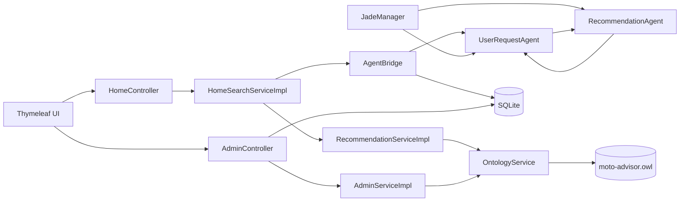
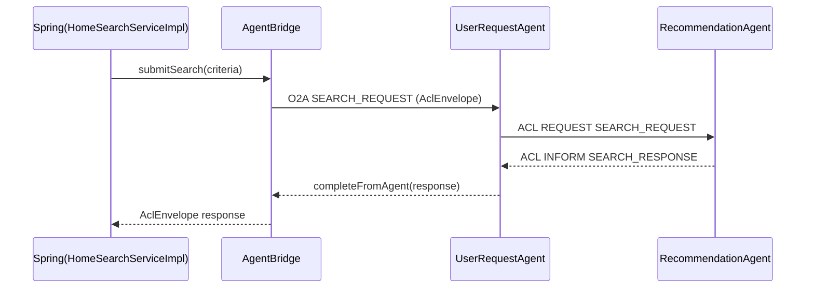

# Moto Advisor Documentation

> Version: 2026-06-13  
> Scope: **Implemented state only** (no planned/future features presented as completed)

---

## Page 1 - Motivation, Goals, and Current Product Scope

### 1.1 Motivation
`moto-advisor` is a Spring Boot web application that helps users find suitable motorcycles from rider preferences. The current implementation combines:
- deterministic recommendation logic,
- ontology-backed motorcycle records (OWL),
- JADE-based agent orchestration with ACL messaging,
- SQLite persistence for operational log data.

### 1.2 Product goals (implemented)
1. Accept rider input from a web form and return recommendation results.
2. Execute recommendation retrieval through the JADE agent path when available.
3. Provide service-level fallback when the agent path fails or times out.
4. Allow manual ontology edits for catalog maintenance (price and availability).
5. Persist operational agent trace rows in SQLite.

### 1.3 What is in production code now
- **Search UI + results UI** with validation, error, and empty-state handling.
- **Admin ontology maintenance UI** (route: `/admin/import`) for manual OWL edits.
- **Admin logs UI** showing persisted agent log rows.
- **JADE main container + 2 agents** (`UserRequestAgent`, `RecommendationAgent`).
- **OWL ontology service** with load/find/update/save methods.
- **OWL-backed recommendation flow** in both JADE and fallback service paths.

### 1.4 Explicitly not claimed as implemented
- Authentication/authorization.
- Public REST API layer.
- Distributed deployment orchestration.
- Advanced semantic reasoner inference beyond implemented OWL property manipulation.

---

## Page 2 - Hard Requirement Mapping (Consolidated)

### 2.1 Hard requirements — consolidated mapping

| Hard requirement | How it is implemented in the project | Example / evidence |
|---|---|---|
| Graphical part | The project is a web application with browser UI (Spring MVC + Thymeleaf). | `src/main/resources/templates/index.html`, `src/main/resources/templates/search/results.html`, `src/main/resources/templates/admin/import.html`, `src/main/resources/templates/admin/agent-logs.html` |
| Ontologies | Motorcycle catalog data is stored in OWL and accessed via `OntologyService`. | `src/main/resources/ontology/moto-advisor.owl`, `OntologyService#findAllMotorcycles`, `OntologyService#updatePrice`, `OntologyService#updateAvailability` |
| Documentation (10+ pages) | This document is structured into 10 pages/sections covering architecture, data model, runtime, and operations. | `DOCUMENTATION.md` pages 1 through 10 |
| At least 2 types of agents | JADE runs two agent types, meeting the minimum requirement. | `UserRequestAgent` and `RecommendationAgent` started by `JadeManager` |
| Agent communication via ACL | Agents exchange messages using an ACL contract wrapped in JSON envelopes. | `AclEnvelope`, `AgentBridge`, flow `UserRequestAgent -> RecommendationAgent -> UserRequestAgent` |
| Ontology manipulation | Ontology records are actively updated by admin operations. | `POST /admin/motorcycles/{modelCode}/edit` updates `priceEur` and `available` and calls `OntologyService#save()` |
| Database with basic information | SQLite stores operational data used outside ontology semantics. | `agent_logs` table actively written by `AgentBridge`; schema in `src/main/resources/schema.sql` |

### 2.2 Requirement-to-code map (high level)

| Requirement area | Implemented | Main code paths |
|---|---|---|
| Search form + results | Yes | `web/HomeController`, `templates/index.html`, `templates/search/results.html` |
| JADE bootstrap + agents | Yes | `agent/JadeManager`, `agent/agents/*` |
| Spring-to-agent bridge (O2A) | Yes | `agent/AgentBridge` |
| ACL JSON contract | Yes | `agent/AclEnvelope` |
| OWL read/write operations | Yes | `ontology/OntologyService`, `ontology/model/MotorcycleOntologyRecord` |
| Ontology-based fallback recommendations | Yes | `service/impl/RecommendationServiceImpl` |
| Admin OWL manual edit page | Yes | `web/AdminController`, `templates/admin/import.html` |
| Agent log page | Yes | `web/AdminController#agentLogs`, `templates/admin/agent-logs.html` |
| SQLite schema initialization | Yes | `resources/schema.sql`, `spring.sql.init.mode=always` |
| Smoke + integration tests | Yes | `src/test/java/...` |

### 2.3 Runtime strategy
The search path is resilient by design:
1. Try JADE path via `AgentBridge`.
2. If JADE returns valid rows, render them as source `JADE`.
3. If JADE fails/times out/returns errors, map issues to UI messages.
4. Fallback to `RecommendationServiceImpl` and render source `RECOMMENDATION_SERVICE`.

Implemented in `HomeSearchServiceImpl#executeSearch`.

---

## Page 3 - Architecture Overview

### 3.1 Logical architecture (implemented)
- **Presentation layer**
  - Thymeleaf templates for search, results, admin maintenance, admin logs.
- **Web layer**
  - `HomeController` (main search flow).
  - `AdminController` (ontology edit view + agent logs).
- **Service layer**
  - `HomeSearchServiceImpl` orchestrates agent-first with fallback.
  - `RecommendationServiceImpl` computes deterministic recommendations from OWL records.
  - `AdminServiceImpl` performs ontology updates and persistence.
  - `OntologyService` loads/queries/updates/saves OWL data.
- **Agent layer**
  - `JadeManager` starts JADE and registers agents.
  - `AgentBridge` handles O2A lifecycle and correlation.
  - `UserRequestAgent` and `RecommendationAgent` execute ACL chain.
- **Persistence layer**
  - SQLite via Spring Data JPA.
  - Active operational table: `agent_logs`.
  - Auxiliary persistence artifacts remain in codebase (`motorcycles`) but are not part of active OWL-only runtime recommendation flow.
- **Knowledge layer**
  - OWL file `src/main/resources/ontology/moto-advisor.owl`.

### 3.2 Component diagram

---

## Page 4 - Ontology Model and Knowledge Operations

### 4.1 Ontology source and loading
- Configured by `app.ontology.path` (current default: `src/main/resources/ontology/moto-advisor.owl`).
- Loaded on startup in `OntologyService#init()`.
- If missing/unreadable, fallback is an empty ontology instance.

### 4.2 Ontology model currently used
Namespace base:
- `http://example.org/moto-advisor#`

Primary class used programmatically:
- `Motorcycle`

Data properties used in code:
- `hasModelCode`
- `hasBrand`
- `hasModelName`
- `hasCategory`
- `engineSizeCc`
- `priceEur`
- `seatHeightMm`
- `weightKg`
- `experienceLevel`
- `available`

### 4.3 Record model abstraction
`MotorcycleOntologyRecord` is the typed projection used by web/service/agent code.

### 4.4 Implemented ontology operations
Implemented in `OntologyService`:
- `findAllMotorcycles()`
- `findAvailableMotorcycles()`
- `findByModelCode(String)`
- `upsertMotorcycle(MotorcycleOntologyRecord)`
- `updatePrice(String, int)`
- `updateAvailability(String, boolean)`
- `save()`

### 4.5 Data lifecycle (current)
- Ontology is loaded on application startup.
- Admin manual edit updates OWL values and persists immediately.
- Search path (JADE and fallback service) reads from OWL-backed records.

---

## Page 5 - Agent System and ACL Flow

### 5.1 Agent bootstrap
`JadeManager`:
- reads `app.jade.enabled`, `app.jade.host`, `app.jade.port`, `app.jade.platform-id`,
- starts a JADE main container,
- registers:
  - `user-request-agent`
  - `recommendation-agent`
- if configured JADE port is busy, it falls back to a free port.

### 5.2 ACL contract
`AclEnvelope` JSON fields:
- `requestId`
- `type`
- `payload`
- `errors`

Utility methods include `toJson()`, `fromJson()`, `ok(...)`, and `error(...)`.

### 5.3 O2A bridge
`AgentBridge`:
- creates request envelope,
- stores `CompletableFuture` per `requestId`,
- sends O2A payload to `UserRequestAgent`,
- waits for response with timeout,
- maps timeout/errors into response envelope,
- persists request/response summaries into `agent_logs`.

### 5.4 Request/response chain

---

## Page 6 - Recommendation and Scoring

### 6.1 JADE-path scoring
`RecommendationAgent`:
- reloads available motorcycles from ontology on each request,
- applies constraints (CC, budget, category, experience, brand),
- computes deterministic score,
- returns ranked rows with reason text.

### 6.2 Service fallback scoring
`RecommendationServiceImpl`:
- reads `ontologyService.findAvailableMotorcycles()`,
- applies hard filters,
- computes score (`+40 experience`, `+30 category`, `+20 cc`, `+10 budget`),
- sorts descending by score.

### 6.3 Explanation generation
Both paths produce an explanation string displayed in `templates/search/results.html`.

### 6.4 Search orchestration
`HomeSearchServiceImpl#executeSearch` returns unified `SearchExecutionResult` with:
- rows,
- synthetic agent flow messages,
- execution errors,
- fallback flag,
- source label.

---

## Page 7 - Database Schema and Persistence

### 7.1 SQLite configuration
From `application.properties`:
- `spring.datasource.url=jdbc:sqlite:${app.db.path}`
- `spring.sql.init.mode=always`
- dialect `org.hibernate.community.dialect.SQLiteDialect`

### 7.2 Schema tables currently declared
Defined in `src/main/resources/schema.sql`:
1. `agent_logs`

Indexes:
- `idx_agent_logs_created_at`
- `idx_agent_logs_conversation_id`

### 7.3 Persistence usage state
- `agent_logs`: actively written by `AgentBridge` and shown in `/admin/agent-logs`.
- `Motorcycle` entity/repository remain as auxiliary persistence artifacts; active recommendation reads ontology records.

---

## Page 8 - Admin and Operations

### 8.1 Admin maintenance page
Route: `GET /admin/import`

Current behavior:
- lists ontology records,
- provides inline manual edit controls for price and availability,
- shows save notices.

### 8.2 Manual ontology edit
Route: `POST /admin/motorcycles/{modelCode}/edit`

Actions:
- update OWL `priceEur`,
- update OWL `available`,
- persist ontology via `OntologyService#save()`.

### 8.3 Agent logs page
Route: `GET /admin/agent-logs`

Shows the latest rows from `agent_logs` with sender/receiver/performative/summary.

### 8.4 Startup behavior
`StartupRunner` logs ontology catalog readiness and record count at application boot.

---

## Page 9 - UI Workflow and User Journeys

### 9.1 Main search workflow
1. User opens `/`.
2. Enters criteria and submits to `/search`.
3. Controller executes `HomeSearchService`.
4. Results page shows:
   - recommendation table,
   - explanation per row,
   - selected criteria,
   - source (`JADE` or `RECOMMENDATION_SERVICE`),
   - fallback/error messages when needed,
   - agent flow summary.

### 9.2 Admin workflow
- **Ontology maintenance**: `/admin/import`
  - review ontology catalog table,
  - edit price/availability,
  - save and verify with next search.
- **Agent logs**: `/admin/agent-logs`
  - inspect persisted message logs.

### 9.3 Empty and error states implemented
- Main form validation errors.
- Search fallback warning message.
- Search execution error list.
- Empty recommendation state.
- Empty ontology records state.
- Empty agent logs state.

---

## Page 10 - Testing, Operations, and Limits

### 10.1 Automated tests currently present
- `OntologyServiceTests`
- `AgentAclIntegrationTests`
- `SchemaInitializationTests`
- `DeterministicScoringServiceTests`
- `FrontendRenderingSmokeTests`
- `MotoAdvisorApplicationTests`

### 10.2 Runtime profile
- Java 21
- Maven wrapper (`./mvnw`)
- SQLite file DB (`moto-advisor.db`)
- JADE container auto-start when `app.jade.enabled=true`

### 10.3 Key runtime configuration
From `src/main/resources/application.properties`:
- `server.port=19091`
- `app.ontology.path=src/main/resources/ontology/moto-advisor.owl`
- `app.jade.host=localhost`
- `app.jade.port=19119`
- `app.jade.platform-id=moto-advisor-platform`
- `app.db.path=moto-advisor.db`

### 10.4 Known implementation notes
1. Admin UI route keeps historical naming (`/admin/import`), but current behavior is OWL maintenance only.
2. `DeterministicScoringServiceImpl` exists and is tested; `RecommendationAgent` currently applies its own deterministic scoring logic inline.
3. `OntologyService.save()` skips classpath paths by design; current configured path is writable filesystem path.

### 10.5 Suggested immediate hardening
- Rename `/admin/import` route/template naming to a neutral maintenance name.
- Remove unused legacy persistence artifacts (`Motorcycle`) if they remain out of scope.
- Optionally refactor `RecommendationAgent` to delegate scoring to `DeterministicScoringService` for single scoring source.

---

## Appendix A - Route Catalog

- `GET /` -> main search form
- `POST /search` -> main search execution
- `GET /admin/import` -> admin ontology maintenance page
- `POST /admin/motorcycles/{modelCode}/edit` -> manual OWL edit
- `GET /admin/agent-logs` -> agent log page

## Appendix B - Core Data Files

- `src/main/resources/ontology/moto-advisor.owl`
- `src/main/resources/schema.sql`
- `src/main/resources/application.properties`

